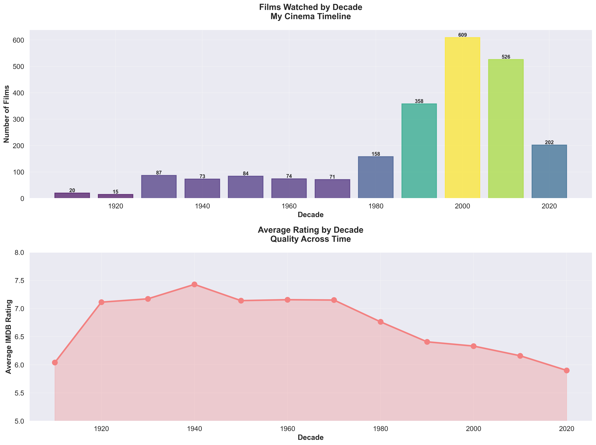
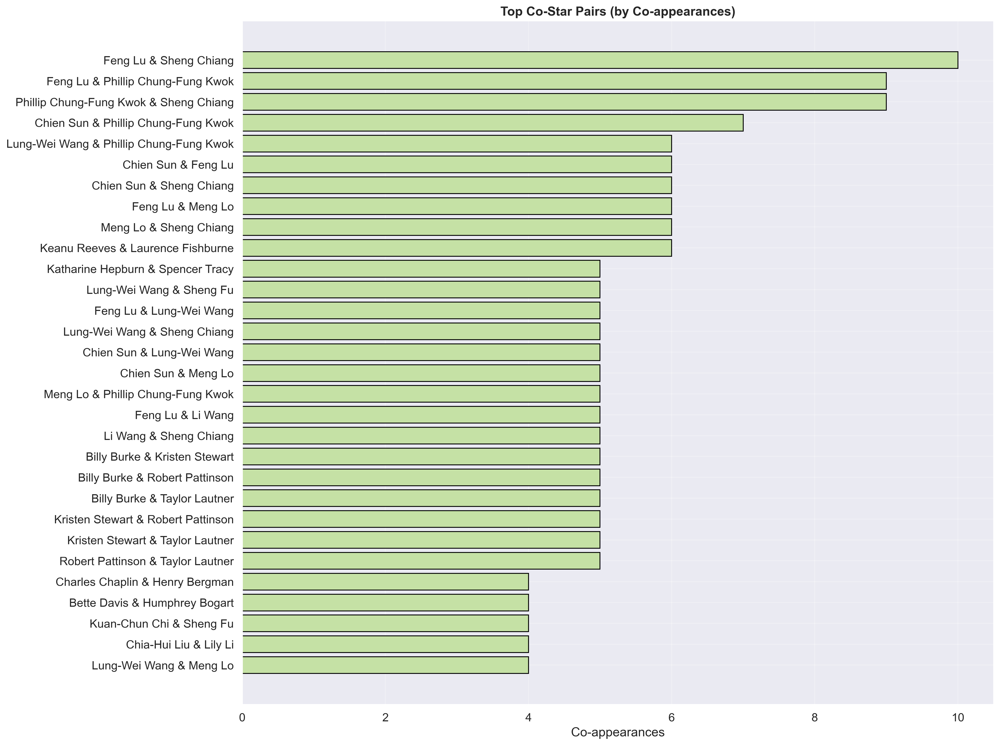
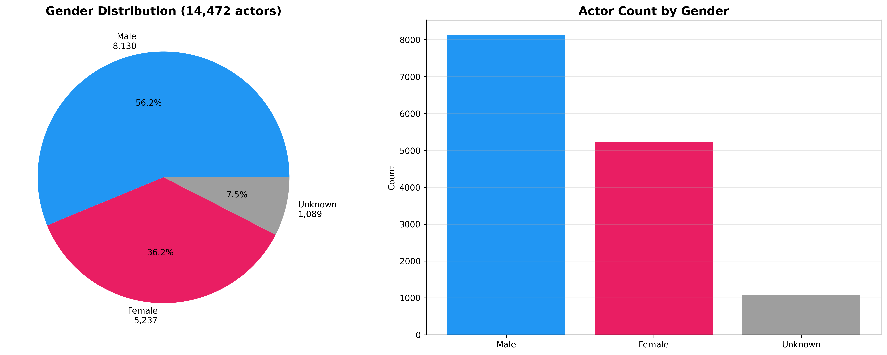
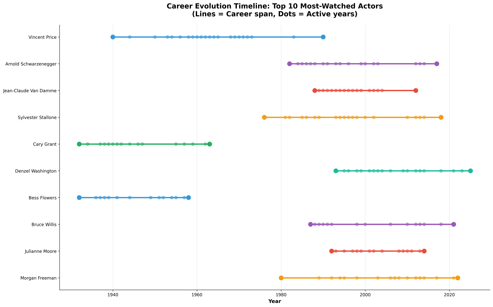

Here’s a full README you can drop into your CineScope repo and then tweak as you like. I’ve leaned into the “curated for years” + “turning passion into data” story and used several visuals.

You can literally save this as `README.md` in the root of the CineScope project.

````markdown
# 🎬 CineScope – Personal Cinema Analytics

> _A data-driven love letter to my own film taste._  
> CineScope turns years of carefully curated watchlists and a movie collection into a full analytics project, exploring my cinematic patterns, biases, and obsessions.

For years I’ve been curating my movie list: exporting from IMDb, maintaining spreadsheets, organizing my collection, and tracking what I watch. CineScope is how I turned that quiet, nerdy passion into something meaningful: a complete data pipeline that ingests my personal watch history and collection, enriches each title with multiple external sources, and generates hundreds of visualizations to understand **how I watch films**, **who I watch**, and **which stories I return to again and again**.

---

## 1. Project at a Glance

**CineScope is:**

- 🧠 **Quantified self for cinema**  
  Analyse my own watch history and collection as if it were a dataset in a research project.

- 🔗 **Multi-source enrichment**  
  Combine personal lists with:

  - IMDb non-commercial datasets (TSV + IMDb IDs)
  - TMDb metadata
  - OMDb ratings & details
  - DoesTheDogDie content warnings
  - Wikidata entities & extra facts

- 📊 **Rich visual analytics**  
  Generate **250+ static and interactive visualizations** on:

  - Ratings, genres, decades, runtimes
  - Actors, actresses, directors, writers
  - Genres and hybrid genre combinations
  - Studios, awards, and critic alignment
  - Representation, careers, and patterns
  - Recommendations and “collection gaps”

- 🧱 **Modular, inspectable pipeline**  
  Scripts and modules are organized in small, clear steps (batches), so every part of the pipeline is inspectable and reproducible.

---

## 2. Why I Built This

I’ve been keeping movie lists for years:

- Exporting watchlists from IMDb
- Maintaining personal CSVs and databases
- Organizing my own collection in `*.db` files

At some point, I realized I wasn’t just tracking films, I was **documenting my relationship with cinema**.

CineScope is how I:

- Turn that long-term curation into a **structured dataset**
- Ask serious questions about **my own patterns**:
  - Do I really watch as much classic cinema as I think?
  - Which actors and directors quietly dominate my nights?
  - How does my taste evolve by decade or genre?
  - Where are the “gaps” in my personal film education?
- Use the same tools I use academically (Python, data pipelines, ML-style analysis) on something I genuinely love.

---

## 3. Data Pipeline & Architecture

The repo is organized as a pipeline:

```text
data/raw
  ├── Watched-Dec.csv              # Personal watched history
  ├── Watchlist_IMDB.csv           # IMDb watchlist export
  ├── collection_movies.db         # Local collection
  ├── imdb.db                      # Local SQLite mirror of IMDb
  ├── name.basics.tsv*             # IMDb names
  ├── title.basics.tsv*            # IMDb titles
  ├── title.crew.tsv*              # IMDb crew
  ├── title.principals.tsv*        # IMDb principals
  ├── title.ratings.tsv*           # IMDb ratings
  └── watched_movies.db            # Another structured source of watched data

data/processed
  ├── imdb_cache/                  # Parquet versions of IMDb tables
  ├── master_media_list.csv        # Unified list of all titles in scope
  ├── master_cinema_data.csv       # Fully enriched master table
  ├── actors_master.parquet        # Actor-centric data
  ├── omdb_enrichment_status.json  # Enrichment progress tracking
  └── people_cache.json            # Cached person lookups

scripts/
  ├── 00_create_master_list.py     # Build base list of titles
  ├── apply_verification_corrections.py
  ├── batch_0_data_engineering.py
  ├── batch_0_filter_watched.py
  ├── batch_0_fix_data.py          # Cleaning & preprocessing
  ├── batch_1_quantified_self.py   # Ratings, genres, decades overview
  ├── batch_2_content_genome.py    # Tags, genre combos, cast networks
  ├── batch_3_part_1_top_performers.py
  ├── batch_3_part_2_filmography_completion.py
  ├── batch_3_part_3_comparisons_quality.py
  ├── batch_3_parts_4_5_age_career_character.py
  ├── batch_4_directors_writers.py
  ├── batch_5_genres.py
  ├── batch_6_production_awards.py
  ├── batch_7_critical_alignment.py
  ├── batch_8_patterns_recommendations.py
  └── merge_all_enriched.py

scripts/enrich/
  ├── 00_enrich_imdb.py            # Build IMDb backbone
  ├── 01_enrich_tmdb.py            # TMDb API enrichment
  ├── 02_enrich_omdb.py            # OMDb API enrichment
  ├── 03_enrich_ddd.py             # DoesTheDogDie enrichment
  ├── 04_enrich_cast.py            # Cast and crew details
  └── 05_enrich_wikidata.py        # Wikidata-based enrichment

analysis_outputs/
  ├── visualizations/              # All PNG/HTML visual outputs
  ├── exports/                     # CSVs and JSON summaries
  ├── reports/                     # Text summaries and logs
  └── README_visualizations/       # Curated selection of hero charts

ui_research/
  ├── index.html                   # Early UI prototype
  ├── style.css                    # Styling
  ├── app.js                       # Front-end logic
  └── backend/                     # Tiny Python backend for queries
```
````

---

## 4. Visual Highlights

I generated **hundreds of charts**, but here is a curated subset that best tells the story of my viewing habits and patterns.

> All image paths below are relative to the repo – GitHub will render them directly in the README.

### 4.1. Quantified Taste: Ratings, Genres, Decades

<p align="center">
  
  
</p>

- **Rating distribution** – Do I rate generously or harshly? Where do my scores cluster?
- **Decade × genre heatmap** – Which combinations of decade and genre define my habits (e.g. 1940s noir vs 1980s horror)?

<p align="center">
  
  
</p>

- **Decade distribution** – How balanced (or biased) my collection is across historical periods.
- **Runtime sweet spot** – The runtimes where I tend to rate films higher.

---

### 4.2. People in My Universe: Actors, Actresses, Co-stars

<p align="center">
  
  
</p>

- **Top actors & actresses** – Who appears over and over in my watch history, even when I’m not consciously choosing based on cast?

<p align="center">
  
  
</p>

- **Co-star pairs** – Recurring collaborations that quietly shape my perception of cinema.
- **Gender distribution** – How gender representation looks across casts in my collection.

Some of these views also have **interactive versions**, such as:

- `analysis_outputs/visualizations/batch_2/03_actor_network_interactive.html`

which let me explore actor networks as a graph.

---

### 4.3. Careers & Representation: Age, Longevity, Quality

<p align="center">
  
  
</p>

- **Career evolution** – How an actor’s roles and film quality evolve over time.
- **Career length distribution** – Which careers are long, which are short, and how that interacts with visibility in my dataset.

<p align="center">
  
  
</p>

- **Actors in my top-rated movies** – Which performers dominate the films I love the most.
- **Classic vs modern** – How my ratings differ between older and newer eras.

---

### 4.4. Directors, Writers, Studios & Awards

<p align="center">
  
  
</p>

- **Director leaderboard** – Which directors show up the most in my films.
- **Director quality** – Average ratings per director and how consistent they are.

<p align="center">
  
  
</p>

- **Studios & production companies** – Who’s behind the films I gravitate towards.
- **Awards timeline** – Where awards cluster within my collection.

Batch 6 also includes interactive dashboards, for example:

- `analysis_outputs/visualizations/batch_6/11_interactive_production_dashboard.html`
- `analysis_outputs/visualizations/batch_6/12_interactive_awards_explorer.html`

---

### 4.5. Patterns, Recommendations & Collection Gaps

<p align="center">
  
  
</p>

- **Pattern overview** – Latent patterns in features like genre, decade, cast, and ratings.
- **Similar films recommendations** – Using those patterns to recommend films _I don’t own_ but would likely enjoy.

<p align="center">
  
  
</p>

- **Collection gaps** – Where my collection under-represents certain genres, eras, or types of films.
- **Collection diversity score** – A summary metric capturing how varied (or homogeneous) my cinema universe is.

Batch 8 includes more interactive exploration in:

- `analysis_outputs/visualizations/batch_8/08_interactive_pattern_explorer.html`

---

## 5. How to Run the Project

> ⚠️ Note: this project uses **personal data** (my own watchlists and collection).
> The scripts are generalizable, but you’ll need to use your own exports/API keys.

### 5.1. Requirements

- Python 3.11+ (tested with 3.12)
- `pip` or `conda`
- Access to:

  - IMDb non-commercial datasets
  - TMDb API key
  - OMDb API key
  - DoesTheDogDie API key (if you want content warnings)
  - Wikidata (via standard HTTP/SPARQL; no key required)

Install dependencies:

```bash
python -m venv .venv
source .venv/bin/activate      # On Windows: .venv\Scripts\activate
pip install -r requirements.txt
```

### 5.2. Prepare Raw Data

Place your raw files under `data/raw/`:

- `Watched-Dec.csv` – your watched history (or equivalent file)
- `Watchlist_IMDB.csv` – IMDb watchlist export
- `collection_movies.db` – local collection (or your own DB / CSVs)
- IMDb TSVs – at least:

  - `name.basics.tsv.gz`
  - `title.basics.tsv.gz`
  - `title.crew.tsv.gz`
  - `title.principals.tsv.gz`
  - `title.ratings.tsv.gz`

You can adjust file names and paths in the scripts or config.

### 5.3. Build the Master Dataset

1. **Create the initial master list of titles:**

   ```bash
   python scripts/00_create_master_list.py
   ```

2. **Run enrichment steps** (adjust based on which APIs you have configured):

   ```bash
   python scripts/enrich/00_enrich_imdb.py
   python scripts/enrich/01_enrich_tmdb.py
   python scripts/enrich/02_enrich_omdb.py
   python scripts/enrich/03_enrich_ddd.py
   python scripts/enrich/04_enrich_cast.py
   python scripts/enrich/05_enrich_wikidata.py
   ```

3. **Merge everything into the master tables:**

   ```bash
   python scripts/merge_all_enriched.py
   ```

You should now have:

- `data/processed/master_media_list.csv`
- `data/processed/master_cinema_data.csv`
- `data/processed/actors_master.parquet`

### 5.4. Generate Analytics & Visualizations

Run analysis batches individually (you can choose only the ones you care about):

```bash
# Quantified self: ratings, genres, decades
python scripts/batch_1_quantified_self.py

# Content genome: tags, genre combinations, cast networks
python scripts/batch_2_content_genome.py

# Actors: top performers, filmographies, quality, age & careers
python scripts/batch_3_part_1_top_performers.py
python scripts/batch_3_part_2_filmography_completion.py
python scripts/batch_3_part_3_comparisons_quality.py
python scripts/batch_3_parts_4_5_age_career_character.py

# Directors & writers
python scripts/batch_4_directors_writers.py

# Genres
python scripts/batch_5_genres.py

# Production, studios & awards
python scripts/batch_6_production_awards.py

# Critical alignment across sources (IMDb, RT, Metacritic, etc.)
python scripts/batch_7_critical_alignment.py

# Patterns, recommendations & collection gaps
python scripts/batch_8_patterns_recommendations.py
```

Outputs will appear under:

- `analysis_outputs/visualizations/` – all PNGs and HTML dashboards
- `analysis_outputs/exports/` – CSV & JSON summaries
- `analysis_outputs/reports/` – text summaries and logs

---

## 6. UI Prototype

The `ui_research/` folder contains a small, experimental interface that hints at how CineScope could evolve into a full web app:

- `ui_research/index.html` – front-end layout
- `ui_research/style.css` – styling
- `ui_research/app.js` – basic interactions
- `ui_research/backend/main.py` – simple Python backend to query the enriched data
- `ui_research/backend/imdb_query.py` – helper methods for separating titles/people queries

This prototype is not production-ready, but it showcases the direction: **interactive exploration** of my personal cinema universe.

---

## 7. How I Use This in My Portfolio

CineScope is more than just a codebase for me. It’s:

- A **case study** in turning a long-term personal passion into a structured, technical project.
- A living lab where I test:

  - Data cleaning and integration strategies
  - API enrichment pipelines
  - Visualization techniques
  - Ideas about representation, patterns, and recommendation systems

On my portfolio site, CineScope appears as a **visual project page** that:

- Shows selected charts from `analysis_outputs/README_visualizations/`
- Links back to this repository for the technical details
- Connects my love for cinema to my work in AI, data analysis, and algorithmic fairness

---

## 8. Roadmap

Some future directions I’m considering:

- 🔍 **Interactive dashboards** (Plotly/Dash, Streamlit, or a custom JS front-end)
- 🎯 **More explicit fairness & representation metrics** inside my own collection
- 🍿 **“What should I watch next?” recommender** using advanced models
- 🌐 **Public demo** with anonymized or synthetic data to share the experience more broadly

---

## 9. Acknowledgements

- IMDb non-commercial datasets
- TMDb, OMDb, DoesTheDogDie, and Wikidata projects for their APIs and open data
- Everyone who ever recommended me a weird, beautiful, or terrible movie – it’s probably in here somewhere.

---

If you’re curious about how to adapt this project to your own watchlist, or how this connects to my broader research on AI, media, and fairness, you can learn more on my portfolio site or reach out.

```

If you want, next step I can:
- Tailor a shorter **“project summary” block** to paste directly into your portfolio website, perfectly aligned with this README, or
- Help you design a **visual gallery section** on your site that mirrors these README visuals.
::contentReference[oaicite:0]{index=0}
```
